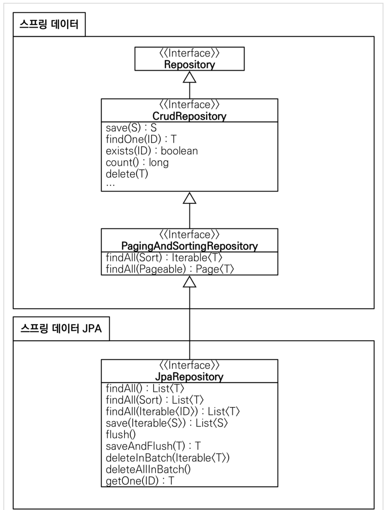

# 💻 코드로 배우는 스프링 부트, 웹 MVC, DB 접근 기술
> 해당 마크다운은 필자가 몰랐거나, 중요하다고 생각하는 내용만 정리할 것입니다.   
   
💡 이 마크다운은 김영한님의 인프런 강의 [스프링 입문 - 코드로 배우는 스프링 부트, 웹 MVC, DB 접근 기술](https://www.inflearn.com/course/%EC%8A%A4%ED%94%84%EB%A7%81-%EC%9E%85%EB%AC%B8-%EC%8A%A4%ED%94%84%EB%A7%81%EB%B6%80%ED%8A%B8/dashboard)을 팔로우하고 있습니다.   
🔌 보다 자세한 내용과 설명은 백기선님의 온라인 강의를 듣는 것을 적극 추천드립니다.         
      
# 프로젝트 생성
**Spring Boot version**      
* version(SNAPSHOT) : 아직 개발 중인 버전          
* version(M1_Milestone) : 정식 릴리즈 전 사용자 테스트 버전               
* version : 정식 릴리즈 된 버전, 안정성이 높은 스프링 라이브러리를 제공한다.          
    
**Project Meatadata**
* Group : 도메인주소(기업 도메인,즉 부서 입력 전까지)
* Artifact : 빌드되어 나올 때 나오는 결과물의 이름 
* Name : 프로젝트의 이름 
    
**package(디렉터리) 분리하기**     
* 패키지에 다른 파일이 없으면 체이닝 형식으로 표기될 때가 많다.(`me.kwj1270.sample`이 하나의 디렉터리로 표현)              
* 프로젝트 네비게이션의 톱니바퀴를 누르면 `[Compact Middle Packages]`가 있으니     
  이를 클릭해주면 디렉터리가 분리되어 표현된다.          

**실행속도 높이기**
최근 IntelliJ 버전은 `Gradle`을 통해서 실행 하는 것이 기본 설정이며 실행속도가 느리다.   
다음과 같이 변경하면 자바로 바로 실행해서 실행속도가 더 빠르다.
     
* `Preferences` -> `Build, Execution, Deployment` -> `Build Tools` -> `Gradle`
  * Build and run using: Gradle IntelliJ IDEA
  * Run tests using: Gradle IntelliJ IDEA
    
**IntelliJ에서 단축키를 확실하게 검색하는 방법**
1. `File Settings`에 들어간다.
2. `keymap`을 선택한다.
3. 검색창에 단축키 이름을 입력한다.   

## 라이브러리 살펴보기

**gradle**         
* gradle 같은 경우 의존받은 라이브러리 + 의존받은 라이브러리가 의존하는 라이브러리 또한 같이 가져온다.             
* 즉, `spring-boot-starter` 밖에 의존 안했는데, 연관된 모든 라이브러리를 가져오기 때문에 `spring core`까지 가져온다.       
* 라이브러리 중복이 발생할 수 도 있는데, 이는 알아서 처리해주고 `*`이라는 표시로 표식을 남겨준다.     
      
**외장 톰캣과 내장 톰캣 차이**     
* 깊게 들어가서 설명은 하지 않겠다.     
* 외장 톰캣을 쓴다면, 웹 서버 프로그램을 실행시키고 자바 코드를 밀어 넣는 식이었다.         
* 요즘에는 소스 라이브러리에서 웹 서버를 들고 있다.(임베디드 서버)       
* 그렇기에 따로 설정할 필요 없이 실행만 하더라도 서버 실행 및 애플리케이션을 배포할 수 있다.        
    
**로그**          
* 현업에서는 로그를 주로 이용한다.           
* 로그로 남기면, 심각한 에러만 따로 모아놓을 수 있고 로그 파일들을 관리할 수 있다.        
* 이전에는 `slf4j`를 많이 썼는데, 요즘에는 `logback`으로 넘어가는 추세이다.    

## View 환경 설정   

**server-side-template**
* 서버 사이드 템플릿 엔진을 사용하고자 한다면 관련 dependency를 의존하도록 하자      
  * `implementation 'org.springframework.boot:spring-boot-starter-thymeleaf'`
* 추가로 검색해서 알았는데, mustache 처럼 헤더 풋터를 만들어 레이앗처럼 사용하고자 한다면 아래와 같은 라이브러리도 의존 받는다.   
  * `implementation 'nz.net.ultraq.thymeleaf:thymeleaf-layout-dialect'`        
* 아직, 사용법은 모르지만 언젠가 쓸 일이 있다면 그 때 검색해보자     

**웹 동작 과정**   
* 클라이언트 -> 서버(tomcat)  
* 서버(tomcat)의 servlet이 controller 호출
* 비즈니스로직 처리
* controller -> 모델을 가지고 -> servlet
* servlet 에서 viewResolver 및 forward
  * `resources:template/`+vireName(Controller 리턴값)+`.html`    
* client는 model을 받음  

## 빌드하고 실행하기
빌드파일 : 하나의 애플리케이션, 관련 라이브러리를 다운받았기에 실행시키기만 하면 바로 애플리케이션이 실행된다.     
우리 같은 경우는 서버가 실행되기에, 도메인을 통해 웹 애플리케이션에 접근 가능하다.    
       
빌드를 진행하기전에 서버 실행한 것을 꺼야 된다.(필수!)(포트 충돌로 한 쪽 실행안됨)       
**빌드파일 생성**  
```gradle
./gradlew build
```   
  
**모든 빌드파일 삭제** 
```gradle
./gradlew clean build
```

## 정적 콘텐츠 
**정적 콘텐츠**   
    
* WAS기법이 아닌, 즉 모델이 없는 경우 `main/resources/static`에서 html을 찾는다.         
* server-side-template이나 어떤 프로그래밍을 하는 html은 작성할 수 없다.        
* 동작 기준-> Controller에 url 관련 매핑이 없을 경우, servlet에서  `main/resources/static`를 찾는다.          

## MVC와 템플릿 엔진 
**동적 콘텐츠**   
* `@RequestParam("name")` 필자가 알기론, 파라미터 이름이 같은 경우 자동으로 주입하지만,    
특별한 상황을 대비해 `@RequestParam("name")`을 통해 요청값을 명확히 가져오는 것이 좋다.     
* `@RequestParam("name")`의 멤버를 살펴보면 `required`라는 것이 존재한다.  
* `required`는 디폴트 값으로 true이고, true이기에 존재하기에 해당 파라미터를 넘겨줘야만 `Controller` 맵핑을 실행한다.    
* 반대로, 우리가 명시적으로 `required=false`한다면, 해당 파라미터가 오지 않아도 매핑을 실행해준다.   
참고: spring-boot-devtools 라이브러리를 추가하면, html 파일을 컴파일만 해주면 서버 재시작 없이 View 파일 변경이 가능하다.         

```
devtools(Developer Tools)는 스프링 부트에서 제공하는 개발 편의를 위한 모듈이다. 
주로 변경된 코드를 서버 또는 화면에 신속하게 반영해 결과를 확인하기 위해서 사용한다.

dev tools 는 일반적으로 서버를 내렸다 올리는 식의 재시작 방법보다 더 빠르게 재시작할 수 있다.     
Devtools는 classpath에 변경이 생기면 이를 감지해 재시작 여부를 판단하게 된다.      
프로그램이 실행되면 polling을 통해 주기적으로 classpath의 변경여부를 확인하고 있기 때문에 가능한 부분이다     
```

```
이외에도 스프링은 request시에 파라미터 이름과 같은 변수가 있으면 클래스에 자동으로 값을 할당해준다.  
단, setter나 파라미터에 맞는 생성자가 있어야 한다.        
```
**thymeleaf**   
```html
<p th:text="'hello' + ${name}">hello! empty</p>
```    
`th:text=`로 서버로 넘어온 값이 출력될텐데 `hello! empty`가 왜 필요할까?       
`thymeleaf`는 서버사이드 템플릿 엔진으로 서버에서 와야 동작한다.     
하지만, 내용물을 넣어놓음으로써 서버를 실행시키지 않고도 해당 레이아웃을 확인하게끔 해주는 것이다.      
   
## API    
  
**@ResponseBody**  
* `@ResponseBody`를 사용하게되면 HttpMessage의 body 부분에 데이터를 직접 넣는다는 것이다.     
* 즉, 특정 resolve 작업을 거치지 않고, 리턴하는 값을 바로 메시지에 넣는 것을 의미한다.        
* 이런 데이터를 JSON으로 내려주면 FrontEnd에서 해당 데이터를 알아서 처리한다고 생각하면 된다.(데이터만 잘 넘기면 된다.)     
* Model과의 차이점은 서버사이드 템플릿은 우리가 HTML을 조작하는 것이고, API는 데이터만 내려주면 Front에서 HTML을 조작한다는 것이다.       
* 리턴 값을 String 이 아닌 다른 레퍼런스 값으로 넘긴다면 아래와 같은 데이터로 치환하여 보낸다. (단, **Getter/Setter** 있어야한다.)    
   
```java  
{변수명 : 값}    
// 클래스의 이름은 나오지 않는다.   
```
  
**동작 방식**      
* `@ResponseBody` 를 사용
  * HTTP의 BODY에 문자 내용을 직접 반환
  * **`viewResolver` 대신에 `HttpMessageConverter`가 동작**   
    * 기본 문자처리: StringHttpMessageConverter
    * 기본 객체처리: MappingJackson2HttpMessageConverter
    * byte 처리 등등 기타 여러 HttpMessageConverter가 기본으로 등록되어 있음
        
즉, 문자열 타입이 오면 문자열 그대로 JSON에 넣는다.             
레퍼런스 타입(객체)가 오면 이를 해석한 후 문자열로 치환하여 JSON에 넣는다. (Jackson 라이브러리 이용)          
  
```
참고: 클라이언트의 HTTP Accept 해더와 서버의 컨트롤러 반환 타입 정보 둘을 조합해서
HttpMessageConverter 가 선택된다. 더 자세한 내용은 스프링 MVC 강의에서 설명하겠다.

Accept: text/html, application/xhtml+xml, application/xml;q=0.9, */*;q=0.8
```   

## 비즈니스 요구사항 정리 
* 컨트롤러: 웹 MVC의 컨트롤러 역할
* 서비스: 핵심 비즈니스 로직 구현
* 리포지토리: 데이터베이스에 접근, 도메인 객체를 DB에 저장하고 관리
* 도메인: 비즈니스 도메인 객체, 예) 회원, 주문, 쿠폰 등등 주로 데이터베이스에 저장하고 관리됨   

## 테스트 케이스 작성  
* 테스트 메서드의 순서는 보장되지 않는다.  
* 그렇기 때문에, 공용된 의존성이 있다면 서로 다른 테스트 메서드에 영향을 줄 수 있다.  
* 예를 들면, 어떤 객체를 저장하고 주소값으로 확인한다 가정한다  
* 하지만, 이미 다른 값이 다른 테스트에 있기 때문에 저장이 안되거나 조회를 했을 때 다른 객체가 나와 비교에 실패한다.(Map 활용시)   
* 그렇기에 `@AfterEach`를 통해 공용으로 의존하는 개체에 저장된 값은 `clear` 해주는 것이 좋다.  
* 이전 스프링부트 aws에서도 레포지토리를 계속 클리어했던것으로 기억난다.   

지금 강의에서는 먼저 클래스르 만들고 테스트를 진행했다.    
하지만, 원래는 테스트를 먼저 만들고 클래스를 만들어야 한다.   
테스트 클래스를 만들때 어떤 **행동**을 수행할 것인가를 관점으로 기능을 만들면 된다.  
자바는 객체지향 언어이고 정적인 상태인 변수와 동적인 형태인 메서드가 있다.  
그렇기에 동적인 형태 -> 행동을 만들어 테스트 케이스를 작성하고 이에 맞게끔 클래스를 설계하자    
  
그리고 이러한 방식을 우리는 TDD라고 부른다.    
요즘 대세이지만 꼭 TDD 방식으로 진행하지 않아도 된다    
클래스 설계가 처음부터 완벽하게 된다면 일반적인 방법으로 하면 된다.     
하지만, 반대로 클래스 설계를 하기 힘들다거나 아니면 설계가 있는데 추가적인 기능을 넣어야 할 것 같거나      
아니면 만들 클래스의 라인이 예를들어 몇백줄이라 치면, 차라리 테스트를 만들고 클래스를 구현하는 것이 더 좋을 수 있다.   
  
`./gradlew test`로 테스트 할 수도 있다.      
전체 테스트 클래스를 테스트하고 싶다면 테스트 디렉터리에서 런하면 된다.   
   
**테스트는 맞는 로직만 검사하는 것이 아니다.**    
엣지케이스나 실패케이스를 넣어서 실패하는지도 확인해야한다.      
일부러 예외를 발생시키고, 예외가 발생했는지 테스팅을 하면 된다.   
이 부분은 정말 중요하다고 생각한다.
예외사항이 우리가 원하는 상황에 발생하는지, 그리고 맞는 테스트케이스만 짜는게 아니라 실패하는 테스트케이스를 짜는 생각이 넓어진다.       
   
**테스트를 할 때는 같은 객체로**   
데이터베이스를 접근하는 레포지토리나, 객체를 한개만 사용해도 되는 경우에는 빈을 등록하고 의존성을 받아서 사용하자  
굳이 2개를 만들면, 서로 데이터가 달라지는 문제가 발생할 수 있다.   
대신, 데이터베이스를 테스트 할 때마다 초기화하면 아주 끔직해진다.   
이에 맞춰서 클래스에 따라 초기화 하는 경우, 그리고 테스트 후 롤백하는 경우 이런걸 잘 파악해야한다.   
   
      
## 서비스 개발 

```java
public Long join(Member member){
    
    Optional<Member> result = memberRepository.findByName(member.getName());
    result.ifPresent(m -> {
        throw new IllegalStateException("이미 존재하는 회원입니다.");   
    });
    
    memberRepository.save(member);
    return member.getId();
}
```
이 코드에서 변경을 할 필요가 있는 권장사항이 있다.     
`Optional<E> instance` 를 사용하는 것은 별로 권장하지 않는다.  
우선 이쁘지 않으며 가독성을 떨어뜨린다.   

그렇기에 참조 변수를 만들어 할당하기 보다, 바로 사용하는 것이 좋다.  
예를 들면 아래와 같이 코딩을 해야한다.  

```java
public Long join(Member member){
    
    memberRepository.findByName(member.getName())
      .ifPresent(m -> {
          throw new IllegalStateException("이미 존재하는 회원입니다.");   
      });
    
    memberRepository.save(member);
    return member.getId();
}
```    
그리고 위 메서드에서 있는지 없는지 검증하는 역할은 따로 메서드로 뽑을 수 있다.       
(저장, 조회 2가지 역할을 메서드에서 하고 있으니 이를 각각 하나의 기능만 수행하도록 메서드로 뽑는다.)       
맥에서는 범위만큼 드래그 한 후 `control + T`를 누르고 `[extract method]`눌러 따로 메서드로 뽑아 분리할 수 있다.       
더 쉽게 하는 방법은 `command + option + m`이 있다.   
   
추가로 `Optional 인스턴스`에서 값을 꺼낼때는 `get()`보단, `orElseGet()`을 사용하여   
값이 있을 때 꺼내고, 값이 없을 때 꺼내지 않는 방식의 코드를 짜는 것이 훨씬좋다.     

## 컴포넌트 스캔과 자동 의존관계 설정   
의존하다 : A클래스에서 B클래스를 받아서 사용하는 관계, **A는 B의 의존관계다.**   

`@Controller`, `@Service`, `@Repository`, `@Bean`, `@Component`와 같은 어노테이션을 사용하면 
스프링 컨테이너에 객체를 생성해서 컨테이너에 넣고 스프링이 관리한다.   
그리고 빈에 등록된 객체를 사용하려는, 즉 의존하려는 객체는 new 하지않고, 주입받아서 사용하면 된다. (생성자, Setter)   
단, 앞서 말했듯이 어노테이션을 통해 빈으로 등록해주어야 한다.   
      
컨테이너에 등록할 빈에 대한 전략은 여러가지인데 기본적으로 싱글톤 패턴으로 설정되어있다.       
설정으로 싱글톤이 아니게 설정할 수 있지만, 특별한 경우를 제외하면 대부분 싱글톤을 사용한다.    
   
**스프링 빈을 등록하는 2가지 방법**
* 컴포넌트 스캔과 자동 의존관계 설정
* 자바 코드로 직접 스프링 빈 등록하기
    
**컴포넌트 스캔 원리**
@Component 애노테이션이 있으면 스프링 빈으로 자동 등록된다.

* @Controller 컨트롤러가 스프링 빈으로 자동 등록된 이유도 컴포넌트 스캔 때문이다.
* @Component 를 포함하는 다음 애노테이션도 스프링 빈으로 자동 등록된다.
  * @Controller
  * @Service
  * @Repository
  * 등등.
* @ComponentScan이 등록된 같은, 하위 패키지만 빈 등록 대상이 된다.      

**의존 받기**
* 생성자에 @Autowired 를 사용하면     
객체 생성 시점에 스프링 컨테이너에서 해당 스프링 빈을 찾아서 주입한다.    
* 생성자가 1개만 있으면 @Autowired 는 생략할 수 있다.     

**자바 코드로 직접 Bean 등록하기**   
```java
package hello.hellospring;
import hello.hellospring.repository.MemberRepository;
import hello.hellospring.repository.MemoryMemberRepository;
import hello.hellospring.service.MemberService;
import org.springframework.context.annotation.Bean;
import org.springframework.context.annotation.Configuration;

@Configuration
public class SpringConfig {
    @Bean
    public MemberService memberService() {
        return new MemberService(memberRepository());
    }

    @Bean
    public MemberRepository memberRepository() {
        return new MemoryMemberRepository();
    }
}
```
`@Configuration`을 클래스에 넣어주고    
`@Bean`을 통해 인스턴스를 만들고 리턴하면        
해당 객체가 컨테이너에 등록되어진다.         

> 참고: XML로 설정하는 방식도 있지만 최근에는 잘 사용하지 않으므로 생략한다.   
       
> 참고: DI에는 필드 주입, setter 주입, 생성자 주입 이렇게 3가지 방법이 있다.        
의존관계가 실행중에 동적으로 변하는 경우는 거의 없으므로 생성자 주입을 권장한다. (제일 안전하다)     
           
> 참고: 실무에서는 주로 **정형화된 컨트롤러, 서비스, 리포지토리 같은 코드는 컴포넌트 스캔을 사용한다.**       
그리고 **정형화 되지 않거나, `상황에 따라 구현 클래스를 변경`해야 하면 설정을 통해 스프링 빈으로 등록한다.**   
즉, 변경 가능성이 있는 클래스들은 직접 만들어 올린다.   
예를들어 강의에서 실제 데이터베이스와 연동되지 않느 클래스를 사용하는데, 이후 바꿀 예정이라면 `@bean` 사용     

예를들어, `return new MemoryMemberRepository();` 대신에    
`return new DbMemberRepository();`로 바꿀 수 있으며, 
다른 코드는 수정하지 않아도 된다. (여기서는 레포지토리인데 이것 말고 다른 클래스일때 쓴다는거다)        
    
> **주의:** @Autowired 를 통한 DI는 helloController , memberService 등과 같이 스프링이 관리하는 객체에서만 동작한다. 
`@Autowired`는 스프링 빈으로 등록하지 않고 내가 직접 생성한 객체에서는 동작하지 않는다.       
     

     
## 스프링 DB 접근 기술    
* h2 데이터베이스 버전은 스프링 부트 버전에 맞춘다.
* 권한 주기: chmod 755 h2.sh
* 실행: ./h2.sh
* 데이터베이스 파일 생성 방법
  * jdbc:h2:~/test (최초 한번)
  * ~/test.mv.db 파일 생성 확인
  * 이후부터는 jdbc:h2:tcp://localhost/~/test 이렇게 접속  
* 로그인 하고 나서 혹시 문제가 생기면 `test.mv.db`를 지우고 다시하자  
* 영한님은 프로젝트 바로 밑에 sql 디렉터리르 만들어서 sql을 관리함 -> 버저관리도 가능하니까   

**build.gradle**
```gradle 
implementation 'org.springframework.boot:spring-boot-starter-jdbc' // 의존성 있어야 DB사용 가능     
runtimeOnly 'com.h2database:h2' // 의존성 있어야 DB랑 붙을 때, 데이터베이스가 필요하느 클라이언트 제공(드라이버)
```

**resources/application.properties**
```properties
spring.datasource.url=jdbc:h2:tcp://localhost/~/test
spring.datasource.driver-class-name=org.h2.Driver
spring.datasource.username=sa
```
필자 기준으로 Datasource 빈을 등록해주어야 했는데 부트에서는 설정파일에서 바로 할 수 있다.      
정확히 말하면 AutoConfiguration으로 이 정보를 토대로 `Datasource`빈을 만들어 활용하는 것  
참고로 **공백 또한 값으로 포함되므로 앞뒤 공백을 주의해야한다.**    
패스워드 값도 존재하면 `spring.datasource.password=패스워드값`를 넣어 줘야한다.     

```
DataSource는 데이터베이스 커넥션을 획득할 때 사용하는 객체다. 스프링 부트는 데이터베이스 커넥션
정보를 바탕으로 DataSource를 생성하고 스프링 빈으로 만들어둔다. 그래서 DI를 받을 수 있다.
```

```java
package hello.hellospring;
import hello.hellospring.repository.JdbcMemberRepository;
import hello.hellospring.repository.JdbcTemplateMemberRepository;
import hello.hellospring.repository.MemberRepository;
import hello.hellospring.repository.MemoryMemberRepository;
import hello.hellospring.service.MemberService;
import org.springframework.context.annotation.Bean;
import org.springframework.context.annotation.Configuration;
import javax.sql.DataSource;

@Configuration
public class SpringConfig {
    private final DataSource dataSource;

    public SpringConfig(DataSource dataSource) {
        this.dataSource = dataSource;
    }

    @Bean
    public MemberService memberService() {
        return new MemberService(memberRepository());
    }

    @Bean
    public MemberRepository memberRepository() {
        // return new MemoryMemberRepository();
        return new JdbcMemberRepository(dataSource);
    }
}
```
빈 등록을 바꾸지만,  
이의존받는 곳에서 `MemoryMemberRepository`와 `JdbcMemberRepository(dataSource);`의 인터페이스로 의존받는다면  
더 이상의 코드를 수정할 필요없이 의존받는 객체를 바꿔서 사용할 수 있다.      
   
이것이 OCP : 개방폐쇄원칙      
        
개방폐쇄원칙, (매우 중요)    
확장에는 열려 있고, 수정, 변경에는 닫혀있다.      
스프링의 DI를 사용하면, **기존 코드를 전혀 손대지 않고, 설정만으로 구현 클래스를 변경할 수 있다.**       

## CRUD를 완성했다면 통합테스트 해보자  
DB 및 스프링을 사용해서 테스트하니 아래 2개의 어노테이션을 클래스 위에 붙여주자  
  
* `@SpringBootTest` : 스프링 컨테이너와 테스트를 함께 실행한다. (컴포넌트 스캔이 되어서 모든 빈 사용가능 -> DI가능)    
* `@Transactional` : 테스트 케이스에 이 애노테이션이 있으면, 테스트 시작 전에 트랜잭션을 시작하고,      
테스트 완료 후에 항상 롤백한다. 이렇게 하면 DB에 데이터가 남지 않으므로 다음 테스트에 영향을 주지 않는다.      

## JPA   
JPA에 대해서는 다른 레포에 많이 기술했으므로 넘어간다.  

```java
//implementation 'org.springframework.boot:spring-boot-starter-jdbc'
implementation 'org.springframework.boot:spring-boot-starter-data-jpa'   
```
`spring-boot-starter-data-jpa`에서는 `jdbc`관련 라이브러리를 포함하고 있으므로 `jdbc`는 생략해도 된다.      
       
```properties
spring.datasource.url=jdbc:h2:tcp://localhost/~/test
spring.datasource.driver-class-name=org.h2.Driver
spring.datasource.username=sa
spring.jpa.show-sql=true
spring.jpa.hibernate.ddl-auto=none
```
> 주의!: 스프링부트 2.4부터는 spring.datasource.username=sa 를 꼭 추가해주어야 한다. 
> 그렇지 않으면 오류가 발생한다.   
    
* show-sql : JPA가 생성하는 SQL을 출력한다.
* ddl-auto : JPA는 테이블을 자동으로 생성하는 기능을 제공하는데 none 를 사용하면 해당 기능을 끈다.
  * create 를 사용하면 엔티티 정보를 바탕으로 테이블도 직접 생성해준다. (기존 테이블 지우고 새로 생성함)   

```java

package hello.hellospring.repository;

import hello.hellospring.domain.Member;

import javax.persistence.EntityManager;
import java.util.List;
import java.util.Optional;

public class JpaMemberRepository implements MemberRepository {
    private final EntityManager em;

    public JpaMemberRepository(EntityManager em) {
        this.em = em;
    }

    public Member save(Member member) {
        em.persist(member);
        return member;
    }

    public Optional<Member> findById(Long id) {
        Member member = em.find(Member.class, id);
        return Optional.ofNullable(member);
    }

    public List<Member> findAll() {
        return em.createQuery("select m from Member m", Member.class)
                .getResultList();
    }

    public Optional<Member> findByName(String name) {
        List<Member> result = em.createQuery("select m from Member m where
                m.name = :name ", Member.class)
                .setParameter("name", name)
                .getResultList();
        return result.stream().findAny();
    }
}
```
이전에 나는 `JpaRepository<V,K>`를 인터페이스 상속받아 사용했는데  
직접 `EntityManager`를 의존성 주입받아 레포지토리를 만들 수 있다는 것을 배웠다.   

* `org.springframework.transaction.annotation.Transactional` 를 사용하자.    
스프링은 해당 클래스의 메서드를 실행할 때 트랜잭션을 시작하고, 메서드가 정상 종료되면 트랜잭션을 커밋한다.     
만약 런타임 예외가 발생하면 롤백한다.       
**JPA를 통한 모든 데이터 변경은 트랜잭션 안에서 실행해야 한다.**   

```java
package hello.hellospring;

import hello.hellospring.repository.*;
import hello.hellospring.service.MemberService;
import org.springframework.context.annotation.Bean;
import org.springframework.context.annotation.Configuration;

import javax.persistence.EntityManager;
import javax.sql.DataSource;

@Configuration
public class SpringConfig {
    private final DataSource dataSource;
    private final EntityManager em;

    public SpringConfig(DataSource dataSource, EntityManager em) {
        this.dataSource = dataSource;
        this.em = em;
    }

    @Bean
    public MemberService memberService() {
        return new MemberService(memberRepository());
    }

    @Bean
    public MemberRepository memberRepository() {
// return new MemoryMemberRepository();
// return new JdbcMemberRepository(dataSource);
// return new JdbcTemplateMemberRepository(dataSource);
        return new JpaMemberRepository(em);
    }
}
```
이제 또 빈 등록을 하는데 DataSource랑, EntityManager가 필요하다.  
이를 의존성 주입받아서 레포클래스를 올리자  

## SpringDataJPA   
스프링 데이터 JPA는 JPA를 편리하게 사용하도록 도와주는 기술입니다.     
따라서 JPA를 먼저 학습한 후에 스프링 데이터 JPA를 학습해야합니다.     

```java
package hello.hellospring.repository;
import hello.hellospring.domain.Member;
import org.springframework.data.jpa.repository.JpaRepository;

import java.util.Optional;

public interface SpringDataJpaMemberRepository extends JpaRepository<Member,
        Long>, MemberRepository {
    Optional<Member> findByName(String name);
}   
```   
    
**스프링 데이터 JPA 제공 기능**   
* 인터페이스를 통한 기본적인 CRUD     
* findByName() , findByEmail() 처럼 메서드 이름 만으로 조회 기능 제공     
* 페이징 기능 자동 제공   
      
            
    
> 참고: 실무에서는 JPA와 스프링 데이터 JPA를 기본으로 사용하고, 복잡한 동적 쿼리는 Querydsl이라는 라이브러리를 사용하면 된다.     
Querydsl을 사용하면 쿼리도 자바 코드로 안전하게 작성할 수 있고, 동적 쿼리도 편리하게 작성할 수 있다.       
이 조합으로 해결하기 어려운 쿼리는 JPA가 제공하는 네이티브 쿼리를 사용하거나, 앞서 학습한 스프링 JdbcTemplate를 사용하면 된다.         
       
스프링 데이터 JPA는 **` JpaRepository<V, K>,`를 상속한 인터페이스를 알아서 구현해주고 스프링 빈으로 자동 등록해준다.**         
이 과정에서 `@Repository` 어노테이션도 붙여줘야 하지만, 생략해도 되게 해주는 장점이 있다.          
또한 추상메서드의 이름에 규칙이 있어 이를 잘만 활용하면 이름만으로도 내가 원하는 쿼리를 만들 수 있다.              
      
## AOP  
### AOP가 필요한 상황  
* 모든 메서드의 호출 시간을 측정하고 싶다면?        
* 공통 관심사항 VS 핵심 관심사항      
* 회원 가입 시간, 회원 조회 시간을 측정하고 싶다면?    
         
AOP에 대해서는 이미 다른 곳에 정리했기에 깊게는 안들어가겠습니다.  
   
**AOP의 장점**   
* 회원가입, 회원 조회등 핵심 관심사항과 시간을 측정하는 공통 관심 사항을 분리한다.
* 시간을 측정하는 로직을 별도의 공통 로직으로 만들었다.
* 핵심 관심 사항을 깔끔하게 유지할 수 있다.
* 변경이 필요하면 이 로직만 변경하면 된다.
* 원하는 적용 대상을 선택할 수 있다.    

**AOP가 적용된다면**   
* 실제 클래스가 아닌 실제 서비스를 상속받은 프록시 클래스가 빈으로 등록된다.   
* 프록시클래스에서 메서드를 실행하면 실은, aop의 메서드가 수행되는 것이다.
* 그렇기에 aop로직이 실행되고 `joinPoint.proceed()`를 통해 실제 클래스의 메서드를 수행한다.  
* 그렇다고 AOP 클래스가 프록시라는 것은 아니다!!!
* 마찬가지로 `joinPoint`도 실제 인스턴스는 아니다. 
* `joinPoint.proceed()`를 통해 실제 인스턴스의 메서드를 실행시키는 것이다.   

AOP와 프록시에 대해서 공부를 해야겠다.   

## 다음으로
지금까지 스프링으로 웹 애플리케이션을 개발하는 방법에 대해서 얇고 넓게 학습했다.       
이제부터는 **각각의 기술들을 깊이있게 이해해야 한다.**         
거대한 스프링의 **모든 것을 세세하게 알 필요는 없다.** 우리는 스프링을 만드는 개발자가 아니다.        
**스프링을 활용해서 실무에서 발생하는 문제들을 잘 해결하는 것이 훨씬 중요하다.**       
따라서 **핵심 원리를 이해하고, 문제가 발생했을 때, 대략 어디쯤 부터 찾아들어가면 될지, 필요한 부분을 찾아서 사용할 수 있는 능력이 더 중요하다.**    
   
   
